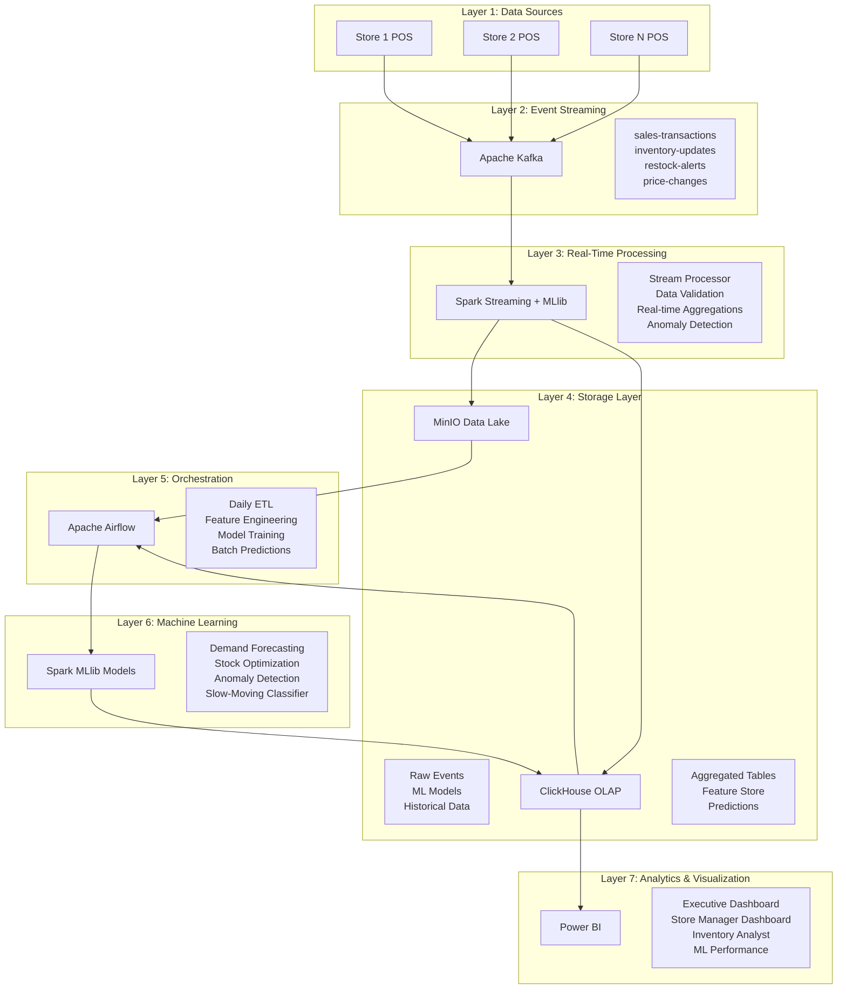

# 🏪 Retail Inventory Management - Technical Architecture

## 🏗️ System Architecture Overview



## 🔧 Technical Components Specification

### 1. Data Sources Layer

#### POS Simulators
- **Technology**: Python scripts
- **Data Types**:
  - Sales transactions (JSON)
  - Inventory updates (JSON)
  - Price changes (JSON)
  - Customer events (JSON)
- **Volume**: 100-500 events/minute per store
- **Format**: JSON with Avro schema validation

#### Event Schema Examples
```json
// Sales Transaction
{
  "transaction_id": "uuid",
  "store_id": "store_001",
  "product_id": "SKU123",
  "quantity": 2,
  "unit_price": 29.99,
  "timestamp": "2025-01-01T10:30:00Z",
  "customer_id": "cust_456",
  "payment_method": "credit_card"
}

// Inventory Update
{
  "inventory_id": "uuid",
  "store_id": "store_001",
  "product_id": "SKU123",
  "quantity_change": -2,
  "new_quantity": 48,
  "reason": "sale",
  "timestamp": "2025-01-01T10:30:00Z"
}
```

### 2. Event Streaming Layer

#### Kafka Configuration
- **Brokers**: 1-3 nodes (single for development)
- **Topics**:
  - `retail-sales-transactions` (3 partitions)
  - `retail-inventory-updates` (3 partitions)
  - `retail-restock-alerts` (1 partition)
  - `retail-price-changes` (2 partitions)
- **Retention**: 7 days
- **Replication**: Factor 1 (development)

#### Producer Configuration
```python
# Kafka Producer Settings
{
  'bootstrap_servers': 'kafka:9092',
  'value_serializer': lambda v: json.dumps(v).encode('utf-8'),
  'acks': 'all',
  'retries': 3,
  'batch_size': 16384,
  'linger_ms': 10
}
```

### 3. Real-Time Processing Layer

#### Spark Streaming Configuration
```python
# Spark Session
spark = SparkSession.builder \
    .appName("RetailInventoryStreaming") \
    .config("spark.sql.adaptive.enabled", "true") \
    .config("spark.sql.adaptive.coalescePartitions.enabled", "true") \
    .config("spark.streaming.backpressure.enabled", "true") \
    .getOrCreate()

# Streaming Configuration
df = spark.readStream \
    .format("kafka") \
    .option("kafka.bootstrap.servers", "kafka:9092") \
    .option("subscribe", "retail-sales-transactions") \
    .option("startingOffsets", "latest") \
    .load()
```

#### Processing Logic
- **Windowed Aggregations**: 5-minute windows
- **Data Validation**: Schema validation, outlier detection
- **Real-time Metrics**:
  - Sales velocity per product
  - Current stock levels
  - Stock-out risk scores
  - Revenue calculations

### 4. Storage Layer

#### MinIO Data Lake Structure
```
minio/
├── raw-data/
│   ├── sales/
│   │   └── year=2025/month=01/day=01/
│   ├── inventory/
│   │   └── year=2025/month=01/day=01/
│   └── events/
│       └── year=2025/month=01/day=01/
├── models/
│   ├── demand-forecast/
│   │   └── v1/
│   └── stock-optimization/
│       └── v1/
└── features/
    ├── training/
    └── inference/
```

#### ClickHouse Schema Design
```sql
-- Fact Tables
CREATE TABLE fact_sales (
    sale_id String,
    date_key Date,
    product_key String,
    store_key String,
    quantity Int32,
    revenue Decimal(10,2),
    cost Decimal(10,2),
    profit Decimal(10,2)
) ENGINE = MergeTree()
PARTITION BY toYYYYMM(date_key)
ORDER BY (date_key, store_key, product_key);

CREATE TABLE fact_inventory (
    inventory_id String,
    date_key Date,
    product_key String,
    store_key String,
    quantity_on_hand Int32,
    reorder_point Int32,
    safety_stock Int32
) ENGINE = MergeTree()
PARTITION BY toYYYYMM(date_key)
ORDER BY (date_key, store_key, product_key);

-- Dimension Tables
CREATE TABLE dim_date (
    date_key Date,
    full_date Date,
    day_of_week UInt8,
    month UInt8,
    quarter UInt8,
    year UInt16,
    is_holiday UInt8,
    is_weekend UInt8
) ENGINE = Memory();

CREATE TABLE dim_product (
    product_key String,
    sku String,
    product_name String,
    category String,
    sub_category String,
    brand String,
    supplier String,
    unit_cost Decimal(10,2),
    shelf_life_days Int32
) ENGINE = Memory();
```

### 5. Orchestration Layer

#### Airflow DAG Structure
```python
# Example DAG: Daily ETL Pipeline
with DAG(
    'daily_etl_pipeline',
    schedule_interval='0 8 * * *',  # 8:00 AM daily
    default_args=default_args,
    catchup=False
) as dag:
    
    extract_task = SparkSubmitOperator(
        task_id='extract_sales_data',
        application='/app/spark_jobs/extract_sales.py'
    )
    
    transform_task = SparkSubmitOperator(
        task_id='transform_and_aggregate',
        application='/app/spark_jobs/transform_data.py'
    )
    
    load_task = SparkSubmitOperator(
        task_id='load_to_clickhouse',
        application='/app/spark_jobs/load_data.py'
    )
    
    extract_task >> transform_task >> load_task
```

### 6. Machine Learning Layer

#### Model Specifications

**Demand Forecasting Model**
- **Algorithm**: Gradient Boosted Trees (GBT)
- **Features**:
  - Historical sales (7, 14, 30, 90 days)
  - Day of week, month, season
  - Promotions and discounts
  - Weather data
  - Local events and holidays
- **Output**: Predicted sales per product/store (next 7 days)

**Stock Optimization Model**
- **Algorithm**: Linear Regression + Business Rules
- **Features**:
  - Forecasted demand
  - Current inventory levels
  - Lead time from suppliers
  - Storage capacity constraints
  - Product shelf life
- **Output**: Optimal reorder quantity & timing

### 7. Visualization Layer

#### Power BI Data Model
- **Connection**: ClickHouse ODBC/JDBC
- **Mode**: DirectQuery (real-time) + Import (scheduled)
- **Refresh**: Every 15 minutes
- **Security**: Row-Level Security (RLS)

#### Dashboard Components
- **Executive Dashboard**: High-level KPIs, revenue trends
- **Store Manager Dashboard**: Real-time stock, alerts, forecasts
- **Inventory Analyst Dashboard**: Deep analytics, optimization
- **ML Performance Dashboard**: Model metrics, accuracy

## 🔄 Data Flow Specifications

### Real-Time Flow (Seconds)
```
POS Event (0s) → Kafka (1s) → Spark Streaming (5s) → 
ClickHouse (10s) → Power BI (15s) → Dashboard Update (20s)
```

### Batch Processing Flow (Hours)
```
Airflow Trigger (8:00) → Spark ETL (8:05) → 
Feature Engineering (8:30) → ML Predictions (9:00) → 
ClickHouse Update (9:15) → Power BI Refresh (9:30)
```

## 📊 Performance Targets

### Latency Requirements
- **Real-time Processing**: < 30 seconds end-to-end
- **Batch Processing**: < 2 hours for daily pipeline
- **Query Response**: < 5 seconds for dashboard queries
- **Model Training**: < 4 hours for weekly retraining

### Scalability Targets
- **Data Volume**: Support 1M+ transactions/day
- **Stores**: Scale to 1000+ retail locations
- **Products**: Handle 50,000+ SKUs
- **Concurrent Users**: Support 100+ dashboard users

## 🔐 Security & Governance

### Data Security
- **Encryption**: TLS for all inter-service communication
- **Authentication**: Service-specific credentials
- **Authorization**: Role-based access control
- **Audit**: Comprehensive logging and monitoring

### Data Governance
- **Data Quality**: Automated validation and monitoring
- **Lineage**: End-to-end data lineage tracking
- **Compliance**: Data retention and privacy policies
- **Monitoring**: Real-time pipeline health monitoring

This technical architecture provides a robust foundation for building a scalable, performant retail inventory management system with comprehensive big data capabilities.